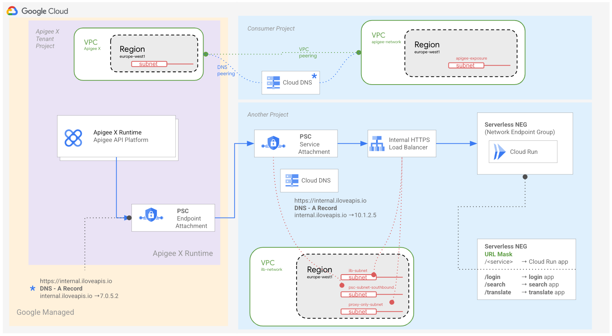

# How to consume internal Cloud Run apps from Apigee X using a single Service Attachment

## Overview

This sample emphasises on the southbound connectivity based on
Private Service Connect (PSC) to communicate with internal Cloud Run
applications through an internal HTTPS (L7) load balancer.



An internal HTTPS load balancer (L7 ILB) is used to serve several Cloud Run apps using Serverless NEG and URL Mask. 

A serverless NEG backend can point to several Cloud Run services.  

A URL mask is a template of your URL schema. The serverless NEG uses this template to map the request to the appropriate service.

The L7 ILB is accessed through a PSC Service Attachment that can be reached by an ApigeeX instance via a PSC endpoint Attachment. These two attachments (Endpoint and Service attachments) must be part of the same GCP region.

Apigee X uses a target endpoint to reach the L7 ILB through the PSC channel. This target endpoint is configured in HTTPS and uses a dedicated hostname (the hostname of the l7 ILB). Therefore we need two DNS resolutions:

- The first on Apigee X (target endpoint) to point to the PSC endpoint attachment: a private Cloud DNS (A record) and a DNS peering are required to manage the resolution. This private zone is configured on the consumer VPC (named apigee-network in the picture above) that is peered with the Apigee X VPC. The DNS peering is configured between the two VPCs for a particular domain (iloveapis.io in the example above)
- The second on the PSC service attachment to point to the L7 ILB: a private Cloud DNS (A record) is required to manage the resolution. This private zone is configured on the VPC (named ilb-network in the picture above). Note that the L7 ILB presents an SSL certificate used to establish a secured communication

An identity token (ID token) is required to consume the different Cloud Run services. 
This ID token is generated on Apigee X and transmitted as a bearer token to the Cloud Run apps.

A service account (```sa_apigee_apiproxy```) is created for this purpose and used to deplpy the API proxy (```cloudrun-api-v1```) on the Apigee X instance.
The permission of this service account is ``` roles/run.invoker ```

## Setup Instructions

You can implement a full or partial install of the sample

### Full installation: Apigee X (PSC NB) + Southbound connectivity to Cloud Run apps using PSC

For this type of installation, we consider that an Apigee X instance has already been provisionned.

### Partial installation: Southbound connectivity to Cloud Run apps using PSC

For this type of installation, we consider that an Apigee X instance has already been provisionned.

We do not care about the existing northbopund connectivity, which can rely on VPC peering or PSC.

Our focus here is the deployment of 3 (basic) internal Cloud Run services and the network components
to consume them from the Apigee X instance. Apigee is of course used to expose these services
as APIs and API products.

<!-- BEGIN_TF_DOCS -->
## Requirements

| Name | Version |
|------|---------|
| <a name="requirement_google"></a> [google](#requirement\_google) | 4.58.0 |

## Providers

| Name | Version |
|------|---------|
| <a name="provider_google"></a> [google](#provider\_google) | 4.58.0 |
| <a name="provider_null"></a> [null](#provider\_null) | 3.2.1 |
| <a name="provider_tls"></a> [tls](#provider\_tls) | 4.0.4 |

## Modules

| Name | Source | Version |
|------|--------|---------|
| <a name="module_cloud_run"></a> [cloud\_run](#module\_cloud\_run) | GoogleCloudPlatform/cloud-run/google | ~> 0.2.0 |

## Resources

| Name | Type |
|------|------|
| [google_apigee_endpoint_attachment.endpoint_attachment](https://registry.terraform.io/providers/hashicorp/google/4.58.0/docs/resources/apigee_endpoint_attachment) | resource |
| [google_artifact_registry_repository.docker-main](https://registry.terraform.io/providers/hashicorp/google/4.58.0/docs/resources/artifact_registry_repository) | resource |
| [google_compute_address.default](https://registry.terraform.io/providers/hashicorp/google/4.58.0/docs/resources/compute_address) | resource |
| [google_compute_forwarding_rule.default](https://registry.terraform.io/providers/hashicorp/google/4.58.0/docs/resources/compute_forwarding_rule) | resource |
| [google_compute_network.default](https://registry.terraform.io/providers/hashicorp/google/4.58.0/docs/resources/compute_network) | resource |
| [google_compute_region_backend_service.default](https://registry.terraform.io/providers/hashicorp/google/4.58.0/docs/resources/compute_region_backend_service) | resource |
| [google_compute_region_network_endpoint_group.cloudrun_neg](https://registry.terraform.io/providers/hashicorp/google/4.58.0/docs/resources/compute_region_network_endpoint_group) | resource |
| [google_compute_region_ssl_certificate.default](https://registry.terraform.io/providers/hashicorp/google/4.58.0/docs/resources/compute_region_ssl_certificate) | resource |
| [google_compute_region_target_https_proxy.default](https://registry.terraform.io/providers/hashicorp/google/4.58.0/docs/resources/compute_region_target_https_proxy) | resource |
| [google_compute_region_url_map.https_lb](https://registry.terraform.io/providers/hashicorp/google/4.58.0/docs/resources/compute_region_url_map) | resource |
| [google_compute_service_attachment.psc_ilb_service_attachment](https://registry.terraform.io/providers/hashicorp/google/4.58.0/docs/resources/compute_service_attachment) | resource |
| [google_compute_subnetwork.default](https://registry.terraform.io/providers/hashicorp/google/4.58.0/docs/resources/compute_subnetwork) | resource |
| [google_compute_subnetwork.proxy_subnet](https://registry.terraform.io/providers/hashicorp/google/4.58.0/docs/resources/compute_subnetwork) | resource |
| [google_compute_subnetwork.psc_ilb_nat](https://registry.terraform.io/providers/hashicorp/google/4.58.0/docs/resources/compute_subnetwork) | resource |
| [google_dns_managed_zone.private-zone-apigee](https://registry.terraform.io/providers/hashicorp/google/4.58.0/docs/resources/dns_managed_zone) | resource |
| [google_dns_managed_zone.private-zone-ilb](https://registry.terraform.io/providers/hashicorp/google/4.58.0/docs/resources/dns_managed_zone) | resource |
| [google_dns_record_set.a-apigee](https://registry.terraform.io/providers/hashicorp/google/4.58.0/docs/resources/dns_record_set) | resource |
| [google_dns_record_set.a-ilb](https://registry.terraform.io/providers/hashicorp/google/4.58.0/docs/resources/dns_record_set) | resource |
| [google_project_iam_member.sa_apigee_apiproxy](https://registry.terraform.io/providers/hashicorp/google/4.58.0/docs/resources/project_iam_member) | resource |
| [google_project_service.gcp_services](https://registry.terraform.io/providers/hashicorp/google/4.58.0/docs/resources/project_service) | resource |
| [google_service_account.service_account_apiproxy](https://registry.terraform.io/providers/hashicorp/google/4.58.0/docs/resources/service_account) | resource |
| [google_service_networking_peered_dns_domain.apigee](https://registry.terraform.io/providers/hashicorp/google/4.58.0/docs/resources/service_networking_peered_dns_domain) | resource |
| [null_resource.login_image_build](https://registry.terraform.io/providers/hashicorp/null/latest/docs/resources/resource) | resource |
| [null_resource.search_image_build](https://registry.terraform.io/providers/hashicorp/null/latest/docs/resources/resource) | resource |
| [null_resource.translate_image_build](https://registry.terraform.io/providers/hashicorp/null/latest/docs/resources/resource) | resource |
| [tls_private_key.default](https://registry.terraform.io/providers/hashicorp/tls/latest/docs/resources/private_key) | resource |
| [tls_self_signed_cert.default](https://registry.terraform.io/providers/hashicorp/tls/latest/docs/resources/self_signed_cert) | resource |

## Inputs

| Name | Description | Type | Default | Required |
|------|-------------|------|---------|:--------:|
| <a name="input_apigee_endpoint_attachment"></a> [apigee\_endpoint\_attachment](#input\_apigee\_endpoint\_attachment) | Apigee endpoint attachment value. | `string` | n/a | yes |
| <a name="input_consumer_vpc"></a> [consumer\_vpc](#input\_consumer\_vpc) | Consumer VPC network name. | `string` | n/a | yes |
| <a name="input_gcp_project_id"></a> [gcp\_project\_id](#input\_gcp\_project\_id) | The GCP project ID to create the gcp resources in. | `string` | n/a | yes |
| <a name="input_gcp_region"></a> [gcp\_region](#input\_gcp\_region) | The GCP region to create the gcp resources in. | `string` | n/a | yes |
| <a name="input_gcp_service_list"></a> [gcp\_service\_list](#input\_gcp\_service\_list) | The list of required Google apis | `list(string)` | <pre>[<br>  "artifactregistry.googleapis.com",<br>  "cloudbuild.googleapis.com",<br>  "run.googleapis.com",<br>  "dns.googleapis.com",<br>  "compute.googleapis.com",<br>  "logging.googleapis.com",<br>  "monitoring.googleapis.com"<br>]</pre> | no |
| <a name="input_gcp_zone"></a> [gcp\_zone](#input\_gcp\_zone) | The GCP zone to create the gcp resources in. | `string` | n/a | yes |
| <a name="input_repository_id"></a> [repository\_id](#input\_repository\_id) | Repository id of the artifact registry. | `string` | n/a | yes |
| <a name="input_url_mask"></a> [url\_mask](#input\_url\_mask) | URL mask of the serverless network endpoint group (neg). | `string` | n/a | yes |

## Outputs

| Name | Description |
|------|-------------|
| <a name="output_service_urls"></a> [service\_urls](#output\_service\_urls) | Cloud Run service URLs |
<!-- END_TF_DOCS -->